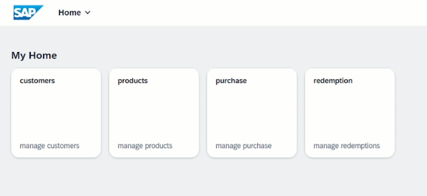

<h1 align="center"> build_code_joule_customer_loyalty </h1>
    

    
    

     

 
 

## 📃 Descrição
Um sistema de fidelidade simples, gerado pela IA Joule, onde os clientes acumulam pontos ao fazer compras. A cada compra, 10% do valor é convertido em pontos, que podem ser consumidos no futuro.

 
 

## 📷 Preview

    

<a href="#">Vídeo de Demonstração do build_code_joule_customer_loyalty</a>

 
 

## 🧑‍🏫 Materiais de Estudo
* <a href="https://learning.sap.com/learning-journeys/exploring-the-sap-business-ai-portfolio-1/getting-to-know-joule-sap-s-next-gen-ai-copilot_c2663bfb-e217-49cb-8020-79025b1462a3">Getting to Know Joule, SAP's Next-Generation AI Copilot</a><bt>
* <a href="https://discovery-center.cloud.sap/protected/index.html#/mymissiondetail/122976/card/11203624/?tab=projectboard">Get Started with SAP Build Code and Joule using Generative AI </a><bt>
* <a href="https://developers.sap.com/tutorials/hcp-create-trial-account..html">Get an Account on SAP BTP Trial</a>  
* <a href="https://developers.sap.com/group.deploy-full-stack-cap-application.html">Deploy a Full-Stack CAP Application in SAP BTP, Cloud Foundry Runtime Following SAP BTP Developer’s Guide</a>  
* <a href="https://developers.sap.com/tutorials/cap-service-deploy.html">Deploy a CAP Business Service to SAP Business Technology Platform</a>

 
 

## 🤝 Colaboradores
<table>
  <tr>
    <td align="center">
      <a href="http://github.com/argelcapela">
         
        
          <b>Argel Capela</b>
        
      </a>
    </td>
  </tr>
</table>

 
 

## 🎯 Status do projeto
* Concluído em versão 1.0

 
 

## 🧰 Erros Comuns

#### 1) BUG: *[EADDRINUSE] - port 4004 is already in use by another server process.* 
Antes de iniciar a aplicação pela primeira vez, execute o seguinte comando dentro da pasta raiz do seu projeto, e pronto. Ao atualizar a versão do sqllite, esse bug deve ser corrigido.

    npm install sqlite3@5.0.0 -D

#### 2) Org Organization não aparece na hora do deploy:
<a href="https://community.sap.com/t5/technology-q-a/issue-in-setting-org-and-space-in-quot-cloud-foundry-sign-in-and-targets/qaq-p/12625671">https://community.sap.com/t5/technology-q-a/issue-in-setting-org-and-space-in-quot-cloud-foundry-sign-in-and-targets/qaq-p/12625671</a> 

 
 

## 🦟 Erros/Feedback
Identificou algum erro ou tem alguma sugestão? Por favor me informe, fico feliz em seguir aprendendo mais e melhorando.